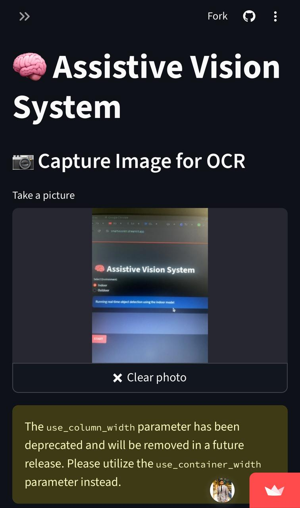
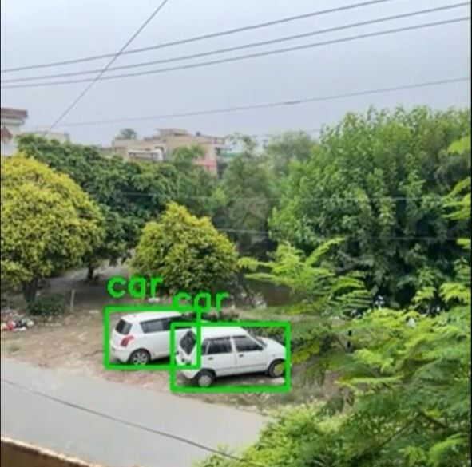
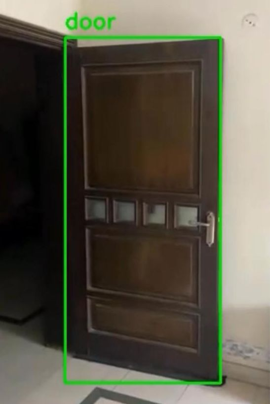

# 🧠 Assistive Vision System

A Streamlit-based application that combines **real-time object detection**, **OCR (Optical Character Recognition)**, and **Text-to-Speech (TTS)** to create an assistive tool for visually impaired users.

This app uses **YOLO models** for indoor and outdoor object detection, **EasyOCR** for text extraction, and **gTTS** for speech synthesis.

---

## 🚀 Features

* **Real-time Object Detection**

  * Indoor & Outdoor YOLO models
  * Visual for detected objects

* **OCR to Speech**

  * Capture text using webcam
  * Preprocess image for better OCR results
  * Convert extracted text to audio (with play button)

* **Interactive Web UI** powered by [Streamlit](https://streamlit.io)

---

## 📦 Installation

1. Clone the repository:

```bash
git clone https://github.com/yourusername/assistive-vision-system.git
cd assistive-vision-system
```

2. Create and activate a virtual environment:

```bash
python -m venv venv
source venv/bin/activate   # On Windows: venv\Scripts\activate
```

3. Install dependencies:

```bash
pip install -r requirements.txt
```

4. Place your YOLO model weights inside the `models/` directory:

```
models/
 ├── indoor.pt
 └── outdoor.pt
```

---

## ▶️ Usage

Run the Streamlit app:

```bash
streamlit run app.py
```

Then open your browser at `http://localhost:8501`.

---

## 📖 App Modes

### 🧍 Object Detection

* Choose **Indoor** or **Outdoor** environment
* Detects objects in real-time using webcam feed
* Displays bounding boxes

### 🔠 OCR to TTS

* Capture an image using webcam
* Extract text with EasyOCR
* Convert extracted text to speech with play button

---

## 🛠️ Tech Stack

* [Streamlit](https://streamlit.io) – Web UI
* [Ultralytics YOLO](https://github.com/ultralytics/ultralytics) – Object detection
* [Streamlit-WebRTC](https://github.com/whitphx/streamlit-webrtc) – Real-time video streaming
* [EasyOCR](https://github.com/JaidedAI/EasyOCR) – Text recognition
* [gTTS](https://github.com/pndurette/gTTS) – Text-to-speech
* [OpenCV](https://opencv.org) – Image processing

---

## 📷 Screenshots

<p float="left">
  
  
  
</p>

---

## 🤝 Contributing

Contributions are welcome! Please open an issue or submit a pull request.

---

## 📜 License

This project is licensed under the MIT License.
